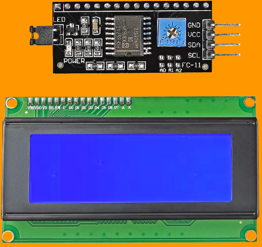
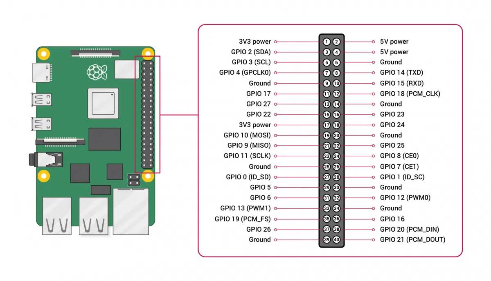
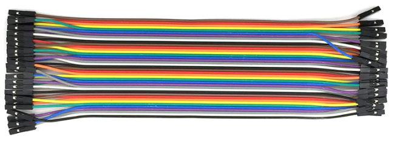
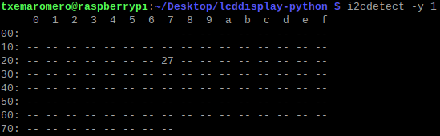
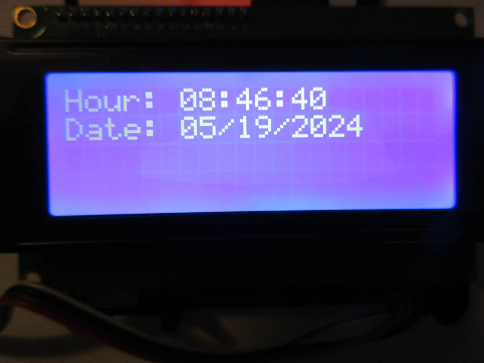

# lcddisplay-python

LCD display I2C with Python and embedded platforms

## Application context

LCD (Liquid Crystal Display) I2C (Inter-Integrated Circuit) is an easy-to-use display module, which can make displaying text easier. Using this module can reduce difficulties faced by makers, so they can focus on their core work. It is a serial communications protocol similar to UART (Universal Asynchronous Reception and Transmission). However, it is not used for PC-device communication but instead with modules and sensors. The advantage of an LCD I2C is that the wiring is straightforward. It is a simple, bidirectional two-wire synchronous serial bus and requires only two wires to transmit information between devices connected to the bus. See SDA (serial data line) and SCL (serial clock line) on the next figure. For example, a standard LCD requires over ten connections.



(Image source: SunFounder).

We will be using Python to program the LCD.


(Image source: https://www.python.org).

## Instructions

### Enable I2C on the embedded platform, e.g, Raspberry Pi



(Image source: https://www.hwlibre.com).

This scheme is valid for Raspberry Pi version 4, 3 and Zero. The connections with I2C module are:

I2C module - Raspberry Pi  
GND - Ground  
VCC - 5V power  
SDA - GPIO 2 (SDA)  
SCL - GPIO 3 (SCL)  

Use 4 female-female connectors:



(Image source: DuPont).

Before we get into the programming, we need to make sure the I2C module is enabled on the Raspberry Pi and install a couple of tools that will make it easier to use I2C.

### Enable I2C in raspi-config

Most people know that you can enable the I2C port using raspi-config.

raspi-config [raspi-config 24] also offers a non-interactive mode, where you can drive it's functionality using command line parameters to it.

Here is how to read the current state of the I2C port:

```
raspi-config nonint get_i2c
```

This command will return:

* 1 if the port is disabled.
* 0 if the port is enabled.

Here is how to enable the I2C port:

```
sudo raspi-config nonint do_i2c 0
```

Again, note that 0 means true / on here.

Here is how to disable the I2C port:

```
sudo raspi-config nonint do_i2c 1
```

1 means "false" or off for this purpose.

Reboot the Raspberry Pi to activate the settings.

### Install I2C-tools and smbus2

Now we need to install a program called I2C-tools, which will tell us the I2C address of the LCD when it is connected to the Raspberry Pi. So, at the command prompt, enter:

```
sudo apt-get install i2c-tools
```

We need to install smbus2, which gives the Python library we are going to use access to the I2C bus on the Raspberry Pi. At the command prompt, enter:

```
pip install smbus2
```

Now reboot the Raspberry Pi and log in again. With your LCD connected, enter:

```
i2cdetect -y 1
```

at the command prompt. This will show you a table of addresses for each I2C device connected to your Raspberry Pi.



### Programming the LCD with Python

We will be using Python [W3Schools 24] to program the LCD.

We collected the code for the Python version. Download the files as a zip using the green button, or clone the repository to your machine using Git.

Uncompress .zip file and type:

```
cd <uncompressed folder>
```

In:  
[lcddisplay-python/I2C_LCD_driver.py](I2C_LCD_driver.py) file, there are a couple things you may need to change in the code, depending on your set up. On line 19 there is a function that defines the port for the I2C bus (`I2CBUS = 1`). Older Raspberry Pi's used port 0, but newer models use port 1. So, depending on which Raspberry Pi model you have, you might need to change this from 1 to 0.
Next, put the I2C address of your LCD in line 22 of the library code. For example, our I2C address is 27, so we will change line 22 to `ADDRESS = 0x27`.

### Write to the LCD

Execute date.py Python file [or clear.py, flicker.py, hello.py, ip.py, pinging.py] At the command prompt, enter:

```
python date.py
```



## References

[raspi-config 24] Raspberry Pi. "The raspi-config Tool". Raspberry Pi Documentation. May 2024.  
Available at: https://www.raspberrypi.com/documentation/computers/configuration.html

[txemaromero/lcddisplay-java 24] txemaromero. "LCD display I2C with Java and embedded platforms". GitHub software repository. May 2024.  
Available at: https://github.com/txemaromero/lcddisplay-java

[Uzayr 21] S. B. Uzayr. "Optimizing Visual Studio Code for Python Development". Apress. ISBN-13: 978-1-4842-7343-2. 21 September 2021.

[VS Code 24] Microsoft. "Python in Visual Studio Code". Visual Studio Code IDE. May 2024.  
Available at: https://code.visualstudio.com/docs/languages/python

[W3Schools 24] W3Schools. "Python Tutorial". Online Web Tutorials. May 2024.  
Available at: https://www.w3schools.com/python/
